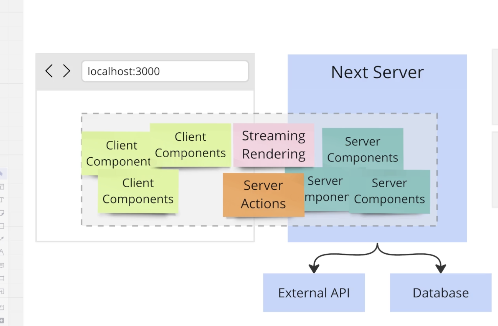
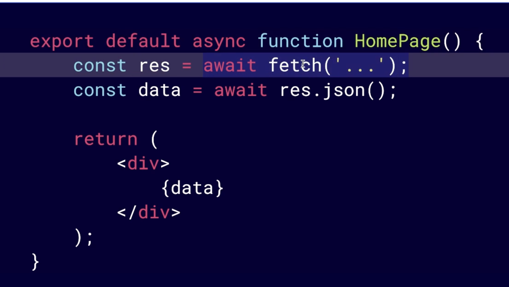
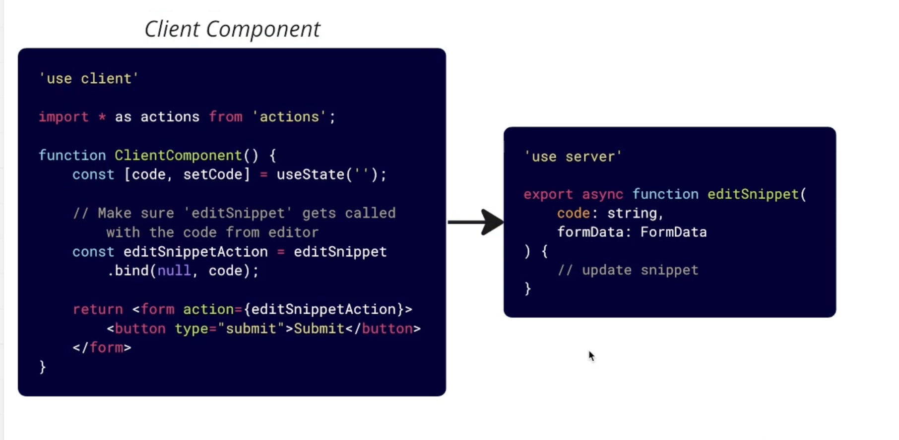

Segundo proyecto con nextJS.
Lo que aprendí🇦🇷:

1. Crear un sqlite bd con prisma

-guardar data en una db local de sqlite.
-para acceder a la db se utiliza prisma.
-npm i prisma
-npx prismpa init --datasource-provider sqlite
-en schema.prisma, se crean modelos de los diferentes tipos de datos que habrá en la aplicacion ( model Snippet) y sus propiedades que se guardarán en la bd.
-luego del cambio, hay que decirle a prisma que utilice esta nueva definicion para crear la base de datos sqlite: npx prisma migrate dev (se le da un nombre para el versionado)

2. Formulario que permita crear un nuevo Snippet y guardarlo en la bd

-crear un prisma client para acceder a la bd. El prisma client es un objeto dentro de la aplicacion que permite interactuar con la bd para añadir,editar,obtener datos. const db = new PrismaClient();
-Server Action: manera en la que vamos a cambiar la data en la aplicación.
-Creacion de snippet utilizando un formulario con server action. Con npx prisma studio puedo ver la bd.
-En una aplicación tradicional de React, toda el codigo javascript se ejecuta en el navegador. Si se necesita informacion se hace una http request a un api externo con fetch o axios.
-Con next: parte del codigo se ejecuta en el servidor y otra parte se queda y se ejecuta en el servidor. Aveces es difícil determinar donde está corriendo el código.
-Entonces, la funcion con la que creamos el nuevo snippet se ejecuta en el servidor. Un javascript que se ejecuta en el navegador va a recoger los valores del formulario y ensamblarlos en un paquete de datos que se envia en una solicitud POST al servidor de next. De allí, recibe los datos y lo pasa al server action. El server action corre en el servidor!
-EN NEXT, PARTE DEL CÓDIGO SE EJECUTA EN EL NAVEGADOR Y OTRA PARTE DEL CÓDIGO EN EL SERVIDOR. ES DIFÍCIL PERO IMPORTANTE SABER DÓNDE ESTÁ CORRIENDO EL CÓDIGO.

-Cada vez que se quiera FETCHEAR DATA se tiene que crear un server component.
-Entonces, NEXT está construido por client components y server components. Los ClientComponents son los componentes de react, con hooks, eventhandlers y demás.
-Cuando usar uno u otro? En la medida de lo posible, vamos a preferir utilizar SERVER COMPONENTS porque están muy integrados con NEXTJS y tendremos mejor performance y user experience.
-Todos los componentes en NEXTJS son por default SERVER COMPONENTS, pages y layouts también.
-Como en los server components se pueden usar async await directamente en el cuerpo del componente, si queremos hacer data fetching ya no hace falta user useState y useState y tampoco redux.
-Si se quiere hacer un fetch de data, el componente debe ser async. export default async function homepage(){}

-LIMITACIONES DE LOS SERVER COMPONENTS:
~ No se puede usar ningun hook
~ No se puede usar event handlers (como el onClick())

-CLIENT COMPONENT: 'use client' arriba del archivo.
~ Pueden usar hooks, definir estados, usar event handlers.
~ No pueden mostrar un SERVER COMPONENT

ENTONCES.... CUANDO USO SC O CC?
-Usar un Client Component cuando se necesite usar un hook o event handler.
Luego en el curso se explica mejor.

-Aunque nuestro componente sea un Client Component, el CC se renderiza una vez en el servidor

3. findMany Snippets

- Como tenemos nuestra bd corriendo en nuestro propio proyecto, lo hacemos con el prisma client bd.snippet.findMany(). en app/page.tsx

4. Rutas dinámicas para obtener solo 1 snippet y NOTFOUND()
   -El nombre de la folder [snippetId] será el nombre del parametro.
   -db.snippet.findFirst()
   -funcion notFound de next/navigation si no encuentra que manda a custom notFound page not-found.tsx

5. loading.tsx que se muestra cuando un server component está fetcheando data.

6. Edit a snippet/[id]/edit. CC INSIDE SV
   -Para usar una libreria de react Monaco editor, necesitamos crear un client component dentro del server component:
   ~SnippetEditPage (server component)
   \/
   ~SnippetEditForm (client component)
   -Importacion de interfaces y type de prisma

Entonces: se obtienen los datos dentro de un server component y luego para trabajar con esos datos adentro del controlador con hooks y handlers, usar un client component

7. Server actions in Nextjs Client Components
   -SERVER ACTIONS NO SE PUEDEN DEFINIR EN CLIENT COMPONENTS.
   hay 2 opciones:
   -1. definir el ServerAction en el SERVER COMPONENT y pasarlo como prop al ClientComponent.
   -2. crear un actions.ts que sea un servercomponent con todas las server actions. RECOMENDABLE

8. Creacion de actions.ts dentro de /src y usar un server action en un client component
   2 opciones 1. -funcion bind Vinculada a un formulario
   ~ const editSnippetAction = actions.editSnippet.bind(null,code) 2. import {startTransition} from 'react', que no está vinculada a un form. Start transition se asegura que no naveguemos antes de que nuestros datos se hayan actualizado realmente.
   ~const handleClick = ()=>{ startTransition(async()=>{
   await actions.editSnippet(code)
   })}

9. Entonces, para llamar a un ServerAction desde un Client Component:
   

10. Validations con useFormState.

11. Error file error.tsx que tiene que ser un client component

*** Sobre el cache y render de data en next ***

12. Comportamientos diferentes al hacer un npm run build. Osea, al correr el código en producción. Se trata del sistema y comportamiento de caché. Diferencia entre rutas static or dynamic. Entonces, una página estatica como la del /, trae los mismos valores que cuando se genero el build. Aunque se agreguen nuevos snippets, traerá los mismos valores. Al refrescar la página se obtienen los mismos exactos valores del archivo html de nuestra bd cuando se buildea el proyecto. Entonces, el comportamiento de caché por defecto es inapropiado para nuestra página '/' porque la data del home page va a cambiar. Se reutiliza el mismo archivo html que se construyó en la build.

13. Qué significa una route static or dynamic?  Al correr npm run build, aparecen simbolos al lado de cada ruta: 
○  (Static)   prerendered as static content
ƒ  (Dynamic)  server-rendered on demand

Por defecto, todas las páginas son estaticas. Para hacerla dinamica hay que hacer cambios.
Las paginas dinamicas no serán almacenadas en cache por next en el momento de la compilacion.
Una manera de cambiar una página de static a dynamic es
   ~export const dynamic = "force-dynamic"; antes del componente.
   ~/snippets/[id]/edit. Los [] la hacen dynamic.

Hay distintas maneras de controlar el cache de una ruta:
   ~ time-based: cada x segundos fecth new data. export const revalidate = 3;
   ~ on-demand: remover el cache de una pagina cuando queramos. revalidatePath('/')
   ~ disable-caching export con export const dynamic = "force-dynamic";

Entonces, para nuestra app, la opcion de resetear el cache on-demand es la más apropiada porque el cache seguiria activo pero solo se renueva cuando hay un cambio en la data!No hacemos una peticion a la bd cada vez que alguien entra a la pagina.

=> Las paginas dinamicas pierden el almacenamiento de caché y seran un poco más lentas. Pero se puede habilitar algo de caché para estas paginas implementando una función generateStaticParams() y por ejemplo si cargamos todas las paginas [id] en la funcion, se veria la version en cache de cada pagina
